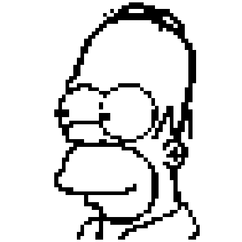
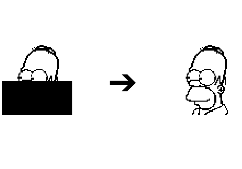
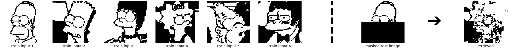
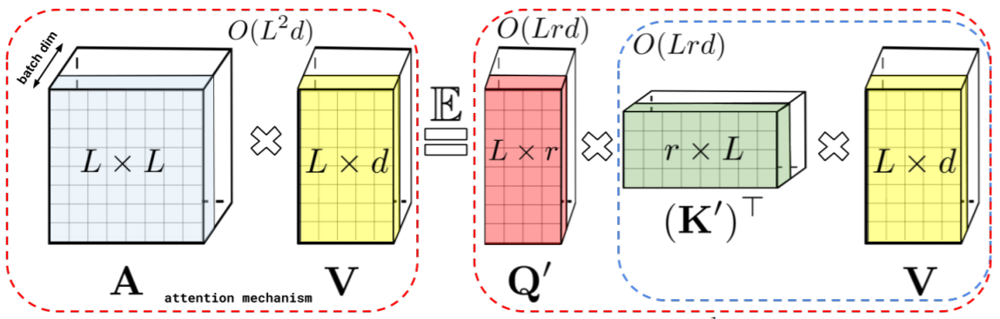

<link rel="stylesheet" href="assets/css/accordion.css">

The recent paper [Rethinking Attention with Performers](https://arxiv.org/abs/2009.14794) constructs a new efficient attention mechanism in an elegant way. It strongly reduces the computational cost for long sequences, while keeping the intriguing properties of the original attention mechanism.
In doing so, Performers have a complexity only linear in the input length, in contrast to the quadratic complexity of standard transformers. This is a major breakthrough in the strive of improving transformer models.

The nicely written [Performer blog post](https://ai.googleblog.com/2020/10/rethinking-attention-with-performers.html) explains the paper very well.

In this blog post, we look at the Performer from a Hopfield Network point of view and relate aspects of the Performer architecture to findings in the field of associative memories and Hopfield Networks.
This blog post has three contributions:
- **Performers resemble classical Hopfield Networks**. Recently, we showed that the update rule of modern continuous Hopfield Networks is the attention of the transformer. We now show that generalized kernelizable attention of the Performer resembles the update rule of classical Hopfield Networks.
- **Sparseness increases memory capacity**. We point out that sparseness considerably increases the memory capacity in classical Hopfield Networks and associative memories, and discuss
how sparseness is achieved by the Performer.
- **Performer normalization relates to continuous Hopfield Network activation function**. We correlate the normalization term $$\widehat{D}^{-1}$$ of the Performer with activation functions of classical continuous Hopfield Networks. 

This blog post is structured as follows:
We start with a short review of classical Hopfield Networks, then interpret generalized kernelizabel attention of the Performer
as 1-step update of a classical Hopfield Network (discrete and continuous), and discuss sparseness and normalization
of the Performer. Finally, we show an exemplary implementation of a continuous classical Hopfield Network for illustrative purpose.

With this blog post we aim at contributing to a better understanding of transformer models.
This blog post loosely builds on our paper [Hopfield Networks is All You Need](https://arxiv.org/abs/2008.02217) and the corresponding [blog post](https://ml-jku.github.io/hopfield-layers/). 

## Classical Hopfield Networks

This part is taken from our [Hopfield Networks is All You Need blog post](https://ml-jku.github.io/hopfield-layers/).
A very good overview of Hopfield Networks can e.g. be found [here](http://www.scholarpedia.org/article/Hopfield_network).

### Binary (Polar) Classical Hopfield Networks

The simplest associative memory is just a **sum of outer products** of the $$N$$ patterns $$\{\boldsymbol{x}_i\}_{i=1}^N$$ that we want to store (Hebbian learning rule). In classical Hopfield Networks these patterns are polar or binary, i.e. $$\boldsymbol{x}_i \in \{ -1,1 \}^d$$ or $$\boldsymbol{x}_i \in \{ 0,1 \}^d$$, respectively, where $$d$$ is the length of the patterns. The corresponding weight matrix $$\boldsymbol{W}$$ for $$\boldsymbol{X}=(\boldsymbol{x_1},\ldots,\boldsymbol{x}_N)$$ is:

$$
\begin{equation}
\boldsymbol{W} = \boldsymbol{X}\boldsymbol{X}^T . \tag{1}
\end{equation}
$$

The weight matrix $$\boldsymbol{W}$$ stores the patterns, which is retrieved starting with a **state pattern** $$\boldsymbol{\xi}$$.

---
**Nomenclature**

We denote the $$N$$ **stored patterns** as $$\{\boldsymbol{x}_i\}_{i=1}^N$$ and any **state pattern** or **state** as $$\boldsymbol{\xi}$$.

---

The basic **synchronuous update rule** is to repeatedly multiply the state pattern $$\boldsymbol{\xi}$$ with the weight matrix $$\boldsymbol{W}$$, subtract the bias and take the sign:

$$
\begin{equation}
\boldsymbol{\xi^{t+1}} =  \text{sgn}(\boldsymbol{W}\boldsymbol{\xi}^t - \boldsymbol{b}) \ , \tag{2}
\label{eq:restorage}
\end{equation}
$$

where $$\boldsymbol{b} \in \mathbb{R}^d$$ is a bias vector, which can be interpreted as threshold for every component.
The **asynchronous update rule** performs this update only for one component of $$\boldsymbol{\xi}$$ and then selects the next component.
Convergence is reached if $$\boldsymbol{\xi^{t+1}} = \boldsymbol{\xi^{t}}$$. 

The asynchronous version of the update rule of Eq. \eqref{eq:restorage} minimizes the **energy function** $$\text{E}$$:

$$
\begin{equation}
\text{E} = -\frac{1}{2}\boldsymbol{\xi}^T \boldsymbol{W} \boldsymbol{\xi} + \boldsymbol{\xi}^T\boldsymbol{b} = -\frac{1}{2} \sum_{i=1}^d\sum_{j=1}^d w_{ij}\xi_i\xi_j + \sum_{i=1}^d b_i\xi_i \ . \tag{3}
\label{eq:energy_hopfield}
\end{equation}
$$

As derived in the papers of [Bruck](https://ieeexplore.ieee.org/stamp/stamp.jsp?tp=&arnumber=58341), [Goles-Chacc et al.](https://www.sciencedirect.com/science/article/pii/0166218X85900290)
and [the original Hopfield paper](https://authors.library.caltech.edu/7427/1/HOPpnas82.pdf),
the convergence properties are dependent on the structure of the weight matrix $$\boldsymbol{W}$$ and the method by which the nodes are updated:

- For asynchronous updates with $$w_{ii} \geq 0$$ and $$w_{ij} = w_{ji}$$, the updates converge to a stable state.
- For synchronous updates with $$w_{ij} = w_{ji}$$, the updates converge to a stable state or a limit cycle of length 2.

For the asynchronous update rule and symmetric weights, $$\text{E}(\boldsymbol{\xi}^{t+1}) \leq \text{E}(\boldsymbol{\xi}^{t})$$ holds. When $$\text{E}(\boldsymbol{\xi}^{t+1}) = \text{E}(\boldsymbol{\xi}^{t})$$ for the update of every component of $$\boldsymbol{\xi}^t$$, a local minimum in $$\text{E}$$ is reached.
For multiple, say $$M$$, state patterns summarized in a matrix $$\boldsymbol{Q}=(\boldsymbol{\xi}_1,\ldots,\boldsymbol{\xi}_M)$$ and $$\boldsymbol{b}=0$$,
the update rule reads

$$
\begin{equation}
\widetilde{\boldsymbol{Q}} = \text{sgn}(\boldsymbol{W}\boldsymbol{Q}) \ . \tag{4}
\label{eq:update_Hopfield}
\end{equation}
$$

In the [Hopfield Networks is All You Need blog post](https://ml-jku.github.io/hopfield-layers/), we illustrate pattern retrieval.

{:refdef: style="text-align: center;"}
{:width="300px"}
{: refdef}

The **weight matrix** $$\boldsymbol{W}$$ is the outer product of this black and white image $$ \boldsymbol{x}_{\text{Homer}} $$:

$$
\begin{equation}
\boldsymbol{W} = \boldsymbol{x}_{\text{Homer}} \boldsymbol{x}_{\text{Homer}}^T \ , \qquad \boldsymbol{x}_{\text{Homer}} \in \{ -1,1\}^d \ , \tag{5}
\label{eq:weight_matrix}
\end{equation}
$$

where for this example $$d = 64 \times 64$$.

It takes one update until the original image is restored.

{:refdef: style="text-align: center;"}
{:width="600px"}
{: refdef}

What happens if we store **more than one pattern**? The weight matrix is then built from the sum of outer products of **six stored patterns** (six input images):

$$
\begin{equation}
\boldsymbol{W} = \sum_{i=1}^6 \boldsymbol{x}_i \boldsymbol{x}_i^T \ , \qquad \boldsymbol{x}_i \in \{ -1,1\}^d \ . \tag{6}
\end{equation}
$$

{:refdef: style="text-align: center;"}

{: refdef}

The example patterns are correlated, and therefore the retrieval has errors.

### Continuous Classical Hopfield Networks

The Performer works with continuous activations while the Hopfield Network is binary. However, also continuous versions of Hopfield Networks have been proposed.
The **energy function of continuous classical Hopfield Networks** is treated by [Hopfield](https://www.pnas.org/content/pnas/81/10/3088.full.pdf) in 1984,
[Koiran](http://cognet.mit.edu/journal/10.1162/neco.1994.6.3.459) in 1994 and [Wang](https://www.semanticscholar.org/paper/On-the-dynamics-of-discrete-time%2C-continuous-state-Wang/d0e873086aec12ee222bab6f92f752590eefecf4) in 1998.
For continuous classical Hopfield Networks the energy function of Eq. \eqref{eq:energy_hopfield} is expanded to:

$$
\begin{equation}
\text{E} (\boldsymbol{\xi}) = -\frac{1}{2}\boldsymbol{\xi}^T \boldsymbol{W} \boldsymbol{\xi} + \boldsymbol{\xi}^T\boldsymbol{b} + \sum_{i=1}^{d} \int_0^{\xi_i} f^{-1}(y) dy \ . \tag{7}
\label{eq:energy_hopfield_continuous}
\end{equation}
$$

In [Hopfield's paper](https://www.pnas.org/content/pnas/81/10/3088.full.pdf) and in an informative [Scholarpedia article](http://www.scholarpedia.org/article/Hopfield_network),
it is shown that the energy function $$\text{E} (\boldsymbol{\xi})$$ of Eq. \eqref{eq:energy_hopfield_continuous} is a **Lyapunov function** of the (continuous) dynamics of $$\boldsymbol{\xi}$$.
In literature, update rules are derived via the underlying ordinary differential equation of the Lyapunov function ([Hopfield](https://www.pnas.org/content/pnas/81/10/3088.full.pdf), [Koiran](http://cognet.mit.edu/journal/10.1162/neco.1994.6.3.459), [Scholarpedia article](http://www.scholarpedia.org/article/Hopfield_network)).
Here, we derive the update rule by applying the **Concave-Convex-Procedure** (CCCP) described by [Yuille and Rangarajan](https://papers.nips.cc/paper/2125-the-concave-convex-procedure-cccp.pdf)
on the energy function of Eq. \eqref{eq:energy_hopfield_continuous}:

- The total energy $$\text{E}(\boldsymbol{\xi})$$ is split into a convex and a concave term: $$\text{E}(\boldsymbol{\xi}) = \text{E}_1(\boldsymbol{\xi}) + \text{E}_2(\boldsymbol{\xi})$$
- The term $$\sum_{i=1}^{d} \int_0^{\xi_i} f^{-1}(y) dy = \text{E}_1(\boldsymbol{\xi}) $$ is convex. We will later see which conditions are sufficient for $$\text{E}_1(\boldsymbol{\xi})$$ to be convex.
- The term $$-\frac{1}{2}\boldsymbol{\xi}^T \boldsymbol{W} \boldsymbol{\xi} + \boldsymbol{\xi}^T\boldsymbol{b} = \text{E}_2(\boldsymbol{\xi})$$ is concave. Since $$\boldsymbol{W}$$ is positive semi-definite (every matrix which can be written as sum of outer products is), $$\frac{1}{2}\boldsymbol{\xi}^T \boldsymbol{W} \boldsymbol{\xi}$$ is convex.
- The CCCP applied to $$\text{E}$$ is:

$$
\begin{equation}
\nabla_{\boldsymbol{\xi}}\text{E}_1(\boldsymbol{\xi}^{t+1}) = - \nabla_{\boldsymbol{\xi}}\text{E}_2(\boldsymbol{\xi}^{t}) \tag{8}
\label{eq:update_cpp1}
\end{equation}
$$

$$
\begin{equation}
\nabla_{\boldsymbol{\xi}}\left( \sum_{i=1}^{d} \int_0^{\xi_i} f^{-1}(y) dy \right)(\boldsymbol{\xi}^{t+1}) = \nabla_{\boldsymbol{\xi}} \left( -\frac{1}{2}\boldsymbol{\xi}^T \boldsymbol{W} \boldsymbol{\xi} + \boldsymbol{\xi}^T\boldsymbol{b} \right)(\boldsymbol{\xi}^t) \tag{9}
\label{eq:update_cpp2}
\end{equation}
$$

$$
\begin{equation}
f^{-1}(\boldsymbol{\xi}^{t+1}) = \boldsymbol{W}\boldsymbol{\xi}^t - \boldsymbol{b} \ . \tag{10}
\label{eq:update_cpp3}
\end{equation}
$$

In order for $$\text{E}_1(\boldsymbol{\xi})$$ to be convex, it is sufficient to ensure that $$f(y)$$ is strictly increasing.
To see this, we argue as follows: If $$f(y)$$ is stricly increasing, then also $$f^{-1}(y)$$ is strictly increasing.
Consequently, the derivative of $$f^{-1}(y)$$ is larger than zero and therefore 

$$
\frac{ \partial^2 \text{E}_1(\boldsymbol{\xi})}{\partial \xi_i \partial \xi_j}= \begin{cases} (f^{-1})'(\xi_i)>0 & \text{ if } i=j \\ 0   & \, \text{else}\end{cases}.
$$

This implies that the Hessian of 
$$\text{E}_1(\boldsymbol{\xi})$$ is a diagonal matrix with strictly positive diagonal elements, thus it is positive definite and therefore $$\text{E}_1(\boldsymbol{\xi})$$ is convex.

Many activation functions fulfill these requirements. In the literature, usually the $$\tanh$$ or sigmoid function is used.

If we now set $$f(y) = \tanh$$, we can rewrite Eq. \eqref{eq:update_cpp3} as:

$$
\begin{equation}
\tanh^{-1}(\boldsymbol{\xi}^{t+1}) = \boldsymbol{W}\boldsymbol{\xi}^t - \boldsymbol{b} \tag{11}
\label{eq:update_cpp4}
\end{equation}
$$

$$
\begin{equation}
\boldsymbol{\xi}^{t+1} = \tanh \left( \boldsymbol{W}\boldsymbol{\xi}^t - \boldsymbol{b} \right) \ . \tag{12}
\label{eq:update_cpp5}
\end{equation}
$$

This now looks very familiar to a one-layer neural network.
Similarly as in Eq. \eqref{eq:update_Hopfield}, for multiple, say $$M$$, state patterns summarized in a matrix $$\boldsymbol{Q}=(\boldsymbol{\xi}_1,\ldots,\boldsymbol{\xi}_M)$$ and $$\boldsymbol{b}=0$$,
the update rule reads

$$
\begin{equation}
\widetilde{\boldsymbol{Q}} = \tanh(\boldsymbol{W}\boldsymbol{Q}) \ . \tag{13}
\label{eq:update_Hopfield_continuous}
\end{equation}
$$

## Performer Attention Resembles Update of Classical Hopfield Networks

---
**Nomenclature change**

We now change from $$N$$ (stored patterns) to $$L$$ (number of input tokens) to be concise with the Performer paper.

---

The following image is taken from the [Rethinking Attention with Performers](https://arxiv.org/abs/2009.14794) paper.
On the left, the transformer self-attention mechanism introduced in the paper [Attention is All You Need](https://arxiv.org/abs/1706.03762) is shown.
The complexity of the transformer self-attention is quadratic with respect to the number of input tokens $$L$$.
On the right, the linear attention framework of the Performer is shown. The linear **generalized kernelizable attention** is implemented via the so-called
**FAVOR+** (*Fast Attention Via positive Orthogonal Random features*) mechanism.

{:refdef: style="text-align: center;"}
{:width="1000px"}
{: refdef}

Let's start by writing down the transformer self-attention $$\boldsymbol{Z}$$ for $$L$$ tokens, hidden dimension $$d$$, token input dimension $$i$$:

$$
\boldsymbol{Z} = \text{softmax} \left(\frac{1}{\sqrt{d_{K}}} \boldsymbol{Q}\boldsymbol{K}^T \right) \boldsymbol{V} \ , \tag{14}
$$

where the dimensions of the involved matrices are the following:

$$
\boldsymbol{Z} \in \mathbb{R}^{L \times d} \ , \\
\boldsymbol{Q} = \boldsymbol{XW}_Q \ , \quad \boldsymbol{Q} \in \mathbb{R}^{L \times d} \ , \boldsymbol{X} \in \mathbb{R}^{L \times i} \ , \boldsymbol{W}_Q \in \mathbb{R}^{i \times d} \ , \\
\boldsymbol{K}^T = \boldsymbol{W}^T_{K} \boldsymbol{X}^T \ , \quad \boldsymbol{K}^T \in \mathbb{R}^{d \times L} \ , \boldsymbol{W}^T_{K} \in \mathbb{R}^{d \times i} \ , \boldsymbol{X}^T \in \mathbb{R}^{i \times L} \ ,\\
\boldsymbol{V} = \boldsymbol{XW}_V \ , \quad \boldsymbol{V} \in \mathbb{R}^{L \times d} \ , \boldsymbol{X} \in \mathbb{R}^{L \times i} \ , \boldsymbol{W}_V \in \mathbb{R}^{i \times d} \ . 
$$

$$d_{K}$$ denotes some normalization constant, often it is set to $$d_K=d$$.

---
**Complexity of the transformer attention**

The attention matrix

$$
\boldsymbol{A} = \text{softmax} \left(\frac{1}{\sqrt{d_{K}}} \boldsymbol{Q}\boldsymbol{K}^T \right) \tag{15}
$$

has the dimensions $$\boldsymbol{A} \in \mathbb{R}^{L \times L}$$ and its **complexity therefore scales quadratically**.
This is a huge disadvantage of the Transformer for long sequences / many tokens.

---

In the Performer paper, the FAVOR+ mechanism is introduced and the transformer self-attention is substituted by
generalized kernelizable attention, whose complexity scales linearly complexity with the number of input tokens $$L$$.
The idea of the Performer is to decompose the attention matrix into a matrix product:

$$
\begin{equation}
\boldsymbol{A}_{\text{Perf}} = \widehat{\boldsymbol{D}}^{-1} \boldsymbol{Q'} \boldsymbol{K'} \ , \tag{16}
\end{equation}
$$

where $$\boldsymbol{Q'}$$ and $$\boldsymbol{K'}$$ can be directly computed from the queries $$\boldsymbol{Q}$$ and the keys $$\boldsymbol{K}$$
using a kernel function $$\phi: \mathbb{R}^d \rightarrow \mathbb{R}^r$$, which maps:

$$
\boldsymbol{Q} \rightarrow \boldsymbol{Q'} \ , \quad \boldsymbol{Q'} \in \mathbb{R}^{L \times r} \ , \\
\boldsymbol{K}^T \rightarrow \boldsymbol{K'}^T \ , \quad \boldsymbol{K'}^T \in \mathbb{R}^{r \times L} \ . \\
$$

Consequently, the generalized kernelizable attention $$\boldsymbol{Z'}$$ reads

$$
\boldsymbol{Z'} = \widehat{\boldsymbol{D}}^{-1} \left( \boldsymbol{Q'} \left( \boldsymbol{K'}^T \boldsymbol{V} \right) \right) \ , \tag{17}
\label{eq:performer_attention}
$$

where $$\widehat{\boldsymbol{D}}^{-1} = \text{diag}\left(\boldsymbol{Q'}\boldsymbol{K'}^T\boldsymbol{1}_L \right)$$, and 
the dimensions of the involved matrices are the following:

$$
\boldsymbol{Z'} \in \mathbb{R}^{L \times d} \ , \\
\boldsymbol{Q'} \in \mathbb{R}^{L \times r} \ , \\
\boldsymbol{K'}^T \in \mathbb{R}^{r \times L} \ , \\
\boldsymbol{V} \in \mathbb{R}^{L \times i} \ . 
$$

---
**Complexity of the Performer attention**

The matrix product $$ \boldsymbol{K'}^T \boldsymbol{V} = \boldsymbol{W}$$ can be computed in linear time in $$L$$, the matrix product $$\boldsymbol{Q'}\boldsymbol{W}$$
can also be computed in linear time in $$L$$. $$\widehat{\boldsymbol{D}}^{-1}$$ is a diagonal matrix and can thus also be computed in linear time in $$L$$.
To summarize, for $$\boldsymbol{Z'}$$ the **complexity therefore scales linearly with $$L$$**. This is the big achievement of the Performer.

---

The matrix product $$ \boldsymbol{K'}^T \boldsymbol{V} = \boldsymbol{W}$$ is the sum of outer products and has the dimension $$\boldsymbol{W} \in \mathbb{R}^{r \times d}$$.
For $$r = d$$, we have

$$
\widetilde{\boldsymbol{Q'}} = \boldsymbol{Q'} \boldsymbol{W} \ , \tag{18}
\label{eq:performer_attention2}
$$

which **resembles the transposed 1-step update of classical binary (polar) and continuous Hopfield Networks** introduced for pattern retrieval in Eq. \eqref{eq:update_Hopfield}
and in Eq. \eqref{eq:update_Hopfield_continuous}, respectively.

Both the mapping $$\phi: \mathbb{R}^d \rightarrow \mathbb{R}^r$$ of Eq. \eqref{eq:performer_attention}
and the normalization $$\widehat{\boldsymbol{D}}^{-1}$$ of Eq. \eqref{eq:performer_attention} play an important role.
This is discussed in the next paragraph.

## The Performer Related to Classical Hopfield Networks

We now relate the Performer to known facts from the field of Hopfield Networks and associative memories, namely sparseness, 1-step update and storage capacity.
We further look at continuous classical Hopfield Networks
and investigate the generalized kernelizable attention of the Performer, especially
by looking at the mapping $$\phi: \mathbb{R}^d \rightarrow \mathbb{R}^r$$
and the normalization $$\widehat{\boldsymbol{D}}^{-1}$$ of Eq. \eqref{eq:performer_attention}.

### About sparseness, 1-step update and storage capacity

One obvious difference between the update of classical Hopfield Networks stated in Eq. \eqref{eq:update_Hopfield}
and the matrix product $$\boldsymbol{Q'} \left( \boldsymbol{K'}^T \boldsymbol{V} \right) = \boldsymbol{Q'} \boldsymbol{W}$$
of the generalized kernelizable attention of Eq. \eqref{eq:performer_attention2} is that the classical Hopfield Network update can be iteratively applied
multiple times, whereas the matrix product $$\boldsymbol{Q'} \boldsymbol{W}$$ is applied only once.
One-step update for classical Hopfield Networks was e.g. investigated in [Schwenker et al.](http://citeseerx.ist.psu.edu/viewdoc/download?doi=10.1.1.45.2550&rep=rep1&type=pdf)
and in [Palm](https://www.sciencedirect.com/science/article/pii/S0893608012002298).
The storage capacity of classical binary Hopfield Networks for fixed-point retrieval of patterns (multiple updates) with a small percentage of errors is $$C \cong 0.14d$$.
In [Schwenker et al.](http://citeseerx.ist.psu.edu/viewdoc/download?doi=10.1.1.45.2550&rep=rep1&type=pdf),
it is shown that for auto-association **one-step retrieval** achieves **nearly the same capacity values** as fixed-point retrieval does.
Furthermore, in [Palm](https://www.sciencedirect.com/science/article/pii/S0893608012002298) it is stated that using **sparse patterns** turns out to achieve **much higher capacity values** ($$C=0.72d$$ for one-step retrieval, which is a factor 5 higher than the classical network capacity $$C=0.14d$$). In [Tsodyks et al.](https://iopscience.iop.org/article/10.1209/0295-5075/6/2/002/pdf), the storage capacity is even found to increase with $$C(p) \sim \frac{1}{p|\ln p|}d$$, where $$p$$ is the percentage of non-zero weights.
An overview of the storage capacities can be found in [Knoblauch et al.](https://www.researchgate.net/publication/38112825_Memory_Capacities_for_Synaptic_and_Structural_Plasticity),
storage capacities in classical Hopfield Networks are also discussed in our blog [Hopfield Networks is All You Need](https://ml-jku.github.io/hopfield-layers/).

To summarize: **Sparse patterns yield very large storage capacities**, also for one-step retrieval.
Below we have a closer look at the mapping $$\phi: \mathbb{R}^d \rightarrow \mathbb{R}^r$$ in the [Rethinking Attention with Performers](https://arxiv.org/abs/2009.14794)
paper and relate the choices of the paper with this statement.

### About the mapping $$\phi$$ and about the normalization $$\widehat{\boldsymbol{D}}^{-1}$$

In the paper [Rethinking Attention with Performers](https://arxiv.org/abs/2009.14794), a kernel function $$\phi: \mathbb{R}^d \rightarrow \mathbb{R}^r$$
maps $$\boldsymbol{Q} \rightarrow \boldsymbol{Q'}$$ and $$\boldsymbol{K}^T \rightarrow \boldsymbol{K'}^T$$.
The kernel function $$\phi$$ is of the form:

$$
\begin{equation}
\phi(\boldsymbol{z}) = \frac{h(\boldsymbol{z})}{\sqrt{r}} \left(f_1(\boldsymbol{w}_1^T\boldsymbol{z}),\ldots,f_1(\boldsymbol{w}_m^T\boldsymbol{z}),\ldots,f_l(\boldsymbol{w}_1^T\boldsymbol{z}),\ldots,f_l(\boldsymbol{w}_m^T\boldsymbol{z}) \right)\ , \tag{19}
\label{eq:kernel_function}
\end{equation}
$$

where $$\boldsymbol{z}$$ are the row vectors of $$\boldsymbol{Q}$$ and $$\boldsymbol{K}$$ (i.e. column vectors of $$\boldsymbol{K}^T$$),
$$f_1,\ldots,f_l$$ are functions that map from $$\mathbb{R}\rightarrow\mathbb{R}$$, $$h$$ is a function that maps from $$\mathbb{R}^d \rightarrow \mathbb{R}$$,
and $$\boldsymbol{w}_1,\ldots,\boldsymbol{w}_m \overset{iid}{\sim} \mathcal{D}$$ are vectors from some distribution $$\mathcal{D}\in \mathcal{P}(\mathbb{R})^d$$. It also immediately follows that $$r=l \cdot m$$.
In the paper, it turns out to work best if $$m=r$$, $$l=1$$, $$\boldsymbol{w}_1,\ldots,\boldsymbol{w}_r$$ are orthogonal random features, and the ReLU function is used for $$f_1$$.

---
- ReLU activation functions **enforce sparseness of $$\boldsymbol{Q'}$$ and $$\boldsymbol{K'}$$**. This nicely complies with the theory of classical Hopfield Networks,
i.e. that **sparse patterns yield very large storage capacities**.

- The $$\tanh$$ function of Eq. \eqref{eq:update_Hopfield_continuous} and the Performer normalization $$\widehat{\boldsymbol{D}}^{-1}$$ of Eq. \eqref{eq:performer_attention} play similar roles.
Namely, they **both keep the result of the one-step pattern retrieval bounded**.

- The **approximation of the original softmax attention** and the subsequent **preservation of the intruiging properties of the original attention mechanism** is achieved via the normalization $$\widehat{\boldsymbol{D}}^{-1}$$ and the introduction of a kernel function, see Eq. \eqref{eq:kernel_function}. It is interesting to note that the 
softmax function of the original attention mechanism can only be approximated in expectation.
In the Performer, both having the approximation based on only a view samples and setting $$f(\cdot)$$ to ReLU does not comply with a proper approximation of the softmax function.
However, this setting is reported to work best in the Performer paper. 

---

## Continuous Hopfield Networks for Illustrative Purpose

In this last part of the blog, we look at some illustrative examples:
- Continuous classical Hopfield Networks
- Sparse continuous classical Hopfield Networks
- Modern continuous Hopfield Networks
- Sparse modern continuous Hopfield Networks
- Performer Networks
- Sparse Performer Networks

#### Continuous Classical Hopfield Networks

We first implement a **continuous classical Hopfield Network**,
and we are going to retrieve a continuous Homer ($$\boldsymbol{\xi}$$) out of many continuous stored patterns $$\boldsymbol{X}=(\boldsymbol{x}_1,\ldots,\boldsymbol{x}_N)$$ using Eq. \eqref{eq:update_cpp5}.
Instead of polar patterns, i.e. $$\boldsymbol{x}_i \in \{ -1, 1\}^d$$ where $$d$$ is the length of the patterns, patterns are now continuous, i.e.
$$\boldsymbol{x}_i \in \left[ -1, 1\right]^d$$.

We start again with the retrieval of only one stored pattern, which is not a too hard job.

{:refdef: style="text-align: center;"}
{:width="600px"}
{: refdef}

The next task is again a retrieval out of six stored patterns, which already does not work any more.

{:refdef: style="text-align: center;"}
{:width="1000px"}
{: refdef}

#### Sparse Continuous Classical Hopfield Networks

We will now exploit the insight from above, namely that **sparse patterns yield very large storage capacities**.
Therefore, all components $$\boldsymbol{\xi}[l] > -0.5$$ and all components $$\boldsymbol{x}_i[l] > -0.5$$ of $$\boldsymbol{X}^T$$  are set to zero,
giving $$\boldsymbol{\xi}_{\text{sparse}}$$ and $$\boldsymbol{X}^T_{\text{sparse}}$$, respectively.
The sparse version of Eq. \eqref{eq:update_cpp5} now reads:

$$
\begin{equation}
\boldsymbol{\xi}^{\text{new}} = \tanh \left( \boldsymbol{X}\boldsymbol{X}^T_{\text{sparse}}\boldsymbol{\xi}_{\text{sparse}} \right) \ . \tag{20}
\label{eq:update_cpp5_sparse}
\end{equation}
$$

{:refdef: style="text-align: center;"}
{:width="1000px"}
{: refdef}

Pattern retrieval now works for 6 stored patterns, but what about more patterns?

{:refdef: style="text-align: center;"}

{: refdef}

#### Modern Continuous Hopfield Networks

It seems that a model with larger storage capacity is needed. Recently, **[Modern Continuous Hopfield Networks](https://ml-jku.github.io/hopfield-layers/)** were
introduced in the paper [Hopfield Networks is All You Need](https://arxiv.org/abs/2008.02217). It was shown that modern continuous Hopfield Networks
can store exponentially (in $$d$$) many patterns.
To retrieve a pattern $$\boldsymbol{\xi}$$, the update rule of modern continuous Hopfield Networks for $$N$$ stored patterns $$\boldsymbol{X} = (\boldsymbol{x}_1,\ldots,\boldsymbol{x}_N)$$ reads:

$$
\begin{equation}
\boldsymbol{\xi}^{\text{new}} = \boldsymbol{X} \text{softmax} (\beta \boldsymbol{X}^T \boldsymbol{\xi}) \ , \tag{21}
\label{eq:update_modern_hopfield}
\end{equation}
$$

where $$\beta$$ is the **inverse temperature**, which controls the **learning dynamics**.
We choose the value $$\beta = 25$$, which enables useful pattern retrieval for 6 stored patterns, but fails if 24 patterns are stored.
Note that the learning dynamics for $$\beta = 25$$ are different to the ones shown in the [Hopfield blog post](https://ml-jku.github.io/hopfield-layers/)
due to normalization of the patterns.

For 6 stored patterns:

{:refdef: style="text-align: center;"}
{:width="1000px"}
{: refdef}

For 24 stored patterns:

{:refdef: style="text-align: center;"}

{: refdef}

#### Sparse Modern Continuous Hopfield Networks

We will now again exploit the insight from above, namely that **sparse patterns yield very large storage capacities**.
Therefore, in Eq. \eqref{eq:update_modern_hopfield} all components $$\boldsymbol{\xi}[l] > -0.5$$ and all components $$\boldsymbol{x}_i[l] > -0.5$$ of $$\boldsymbol{X}^T$$  are set to zero,
giving $$\boldsymbol{\xi}_{\text{sparse}}$$ and $$\boldsymbol{X}^T_{\text{sparse}}$$, respectively.
The sparse version of Eq. \eqref{eq:update_modern_hopfield} now reads:

$$
\begin{equation}
\boldsymbol{\xi}^{\text{new}} = \boldsymbol{X} \text{softmax} (\beta \boldsymbol{X}_{\text{sparse}}^T \boldsymbol{\xi}_{\text{sparse}}) \ , \tag{22}
\label{eq:update_modern_hopfield_sparse}
\end{equation}
$$

For 6 stored patterns:

{:refdef: style="text-align: center;"}

{: refdef}

For 24 stored patterns:

{:refdef: style="text-align: center;"}

{: refdef}

#### Performer Networks

In the paper [Hopfield Networks is All You Need](https://arxiv.org/abs/2008.02217), it is further shown that the update rule of Eq. \eqref{eq:update_modern_hopfield} of modern continuous Hopfield Networks
is the self-attention of transformer networks. We therefore use the insights of the Performer paper to substitute Eq. \eqref{eq:update_modern_hopfield} by:

$$
\begin{equation}
\boldsymbol{\xi'}^{\text{new}} = \boldsymbol{X} \ \mathbb{E}\left[ \boldsymbol{X'}^T \boldsymbol{\xi'} \widehat{\boldsymbol{D}}^{-1}\right]   \ . \tag{23}
\label{eq:update_performer_one_step}
\end{equation}
$$

Equation \eqref{eq:update_performer_one_step} directly follows out (of the transposed) of Eq. \eqref{eq:performer_attention} by setting $$\boldsymbol{Q}$$ to $$\boldsymbol{\xi}$$ (pattern to retrieve) and setting $$\boldsymbol{K}$$ and $$\boldsymbol{V}$$ to $$\boldsymbol{X}$$ (matrix of stored patterns).
To obtain $$\boldsymbol{X'}$$ and $$\boldsymbol{\xi'}$$, we use the mapping $$\phi(\boldsymbol{z})$$ introduced in Eq. \eqref{eq:kernel_function}, using $$h(\boldsymbol{z}) = \exp\left( - \frac{\|\boldsymbol{z} \|^2}{2} \right)$$, $$l=1$$, $$f_1(\cdot) = \exp(\cdot)$$, and one drawn set of orthogonal random features $$\boldsymbol{w}_1, \ldots, \boldsymbol{w}_r$$. In the mapping, we further set $$\boldsymbol{z}$$ to $$\sqrt{\beta} \boldsymbol{z}$$ to operate in the same regime as Eq. \eqref{eq:update_modern_hopfield}. $$\mathbb{E}$$ is the expectation over $$\boldsymbol{X'}^T \boldsymbol{\xi'} \widehat{\boldsymbol{D}}^{-1}$$.

For 6 stored patterns:

{:refdef: style="text-align: center;"}
{:width="1000px"}
{: refdef}

For 24 stored patterns:

{:refdef: style="text-align: center;"}

{: refdef}

For clarity, let's now visualize what is going on here:

{:refdef: style="text-align: center;"}

{: refdef}

#### Sparse Performer Networks

We will now again exploit the insight from above, namely that **sparse patterns yield very large storage capacities**.
Therefore, in Eq. \eqref{eq:update_performer_one_step} all components $$\boldsymbol{\xi}[l] > 0.5$$ and all components $$\boldsymbol{x}_i[l] > 0.5$$ of $$\boldsymbol{X}^T$$  are set to zero,
giving $$\boldsymbol{\xi}_{\text{sparse}}$$ and $$\boldsymbol{X}^T_{\text{sparse}}$$. Interestingly, in this case too much sparseness hurts more than it helps. 
The sparse version of Eq. \eqref{eq:update_performer_one_step} now reads:

$$
\begin{equation}
\boldsymbol{\xi'}^{\text{new}} = \boldsymbol{X} \ \mathbb{E}\left[\boldsymbol{X'}_{\text{sparse}}^T \boldsymbol{\xi'}_{\text{sparse}} \widehat{\boldsymbol{D}}^{-1}\right]   \ . \tag{24}
\label{eq:update_performer_one_step_sparse}
\end{equation}
$$

For 6 stored patterns:

{:refdef: style="text-align: center;"}
{:width="1000px"}
{: refdef}

For 24 stored patterns:

{:refdef: style="text-align: center;"}

{: refdef}

For clarity, let's now again visualize what is going on here:

{:refdef: style="text-align: center;"}

{: refdef}

## Material

- [Paper: Rethinking Attention with Performers](https://arxiv.org/abs/2009.14794)

- [Blog post to paper: Rethinking Attention with Performers](https://ai.googleblog.com/2020/10/rethinking-attention-with-performers.html)

- [Paper: Hopfield Networks is All You Need](https://arxiv.org/abs/2008.02217)

- [Blog post to paper: Hopfield Networks is All You Need](https://ml-jku.github.io/hopfield-layers/)

- [Yannic Kilcher's video on Performer](https://www.youtube.com/watch?v=xJrKIPwVwGM&t=1152s)

- [Yannic Kilcher's video on Hopfield Networks](https://www.youtube.com/watch?v=nv6oFDp6rNQ&t=2920s)

## Correspondence

This blog post was written by [Johannes Brandstetter](https://www.jku.at/en/institute-for-machine-learning/about-us/team/ass-prof-dr-johannes-brandstetter/) and [Hubert Ramsauer](https://www.jku.at/en/institute-for-machine-learning/about-us/team/hubert-ramsauer/).

Contributions by Markus Holzleitner and Sepp Hochreiter.